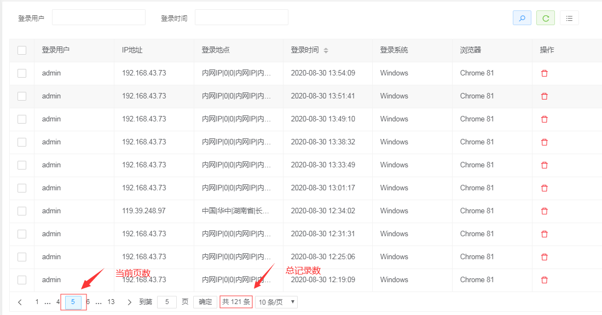

# 分页查询

## 介绍

并且不是在数据库里面直接去查上万条数据，而是根据分页显示的数据的容量去数据库拿相应容量的数据。

下图展示的是登录日志分页查询的前端界面，当前显示的是第5页的登录日志，总共包含121条记录。



想必我们都有过这样的体验，如果不借助其他插件或者工具自己去实现分页查询需求的时候，需要先写一个查询总记录数的sql语句，然后再写一个真正分页查询的语句。这个过程需要花双倍的时间写 count 和 select。

Mysql数据库提供了分页的函数`limit m,n`

比如：

查询第一页的数据(查询第1条到第10条的数据的sql)

```sql
select * from table limit 0,10;  
```

查询第二页的数据(查询第10条到第20条的数据的sql)

```sql
select * from table limit 10,20;
```

查询第三页的数据(查询第20条到第30条的数据的sql)

```sql
select * from table limit 20,30;
```

查询总记录数sql

```sql
select count(*) from table
```

幸好`Foundation`框架帮我们实现了分页查询的功能，我们只要按照`Fundation`框架约定的方式进行操作便可非常方便的实现分页查询。它的优点是，分页和Mapper.xml完全解耦，有效的避免了我们需要直接写分页SQL语句来实现分页功能。


 Signature来指定咱们需要拦截那个类对象的哪个方法


| StatementHandler | 封装了JDBC Statement操作，负责对JDBC statement 的操作，如设置参数、将Statement结果集转换成List集合 |
| ---------------- | ------------------------------------------------------------ |
|                  |                                                              |


Foundation框架已经利用面向切面编程的思想把分页查询的处理细节从我们的业务中抽离出来，实现与我们的业务解耦。因此，我们在处理分页查询的时候不用再去关注分页查询处理的细节，只需聚焦于我们的具体业务逻辑。