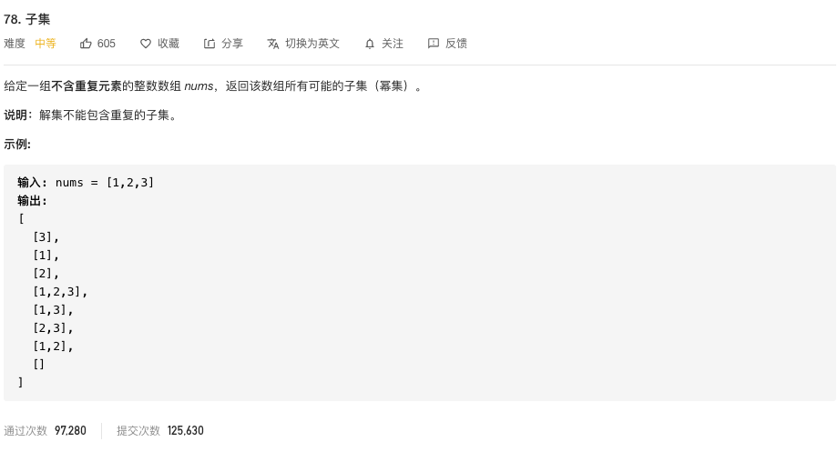

# 回溯算法

这一篇文章来讲解一下如何做leetcode回溯算法题目，这一段时间我把leetcode上面的回溯算法的题目都刷了个遍，发现了其中一些规律，所以，就想写一篇文章来总结一下，怕以后忘记。

刷完回溯算法的题目，我发现其实可以总结为三大类：子集问题、组合问题、排列问题，那这三大类都是什么意思呢，我分别举一个例子来说明。

**子集问题**，比如说，数组`[1,2,3]`，那么对应的子集问题就是，这个数组的子集有：`[],[1],[2],[3],[1,3],[2,3],[1,2],[1,2,3]`，这就是这个数组的子集，这一类问题在leetcode上面很多个，而且有些题目数组中的元素是可以重复的，然后来求子集问题。

**组合问题**，比如说，数组`[1,2,3]`，组合出target为3的可能的选择，那么就有：`[1,2],[3]`，这就是leetcode中的组合问题。

**排列问题**，排列问题就比较简单了，比如，我们常见的全排列问题，leetcode也有这一类问题。

这篇文章，我们就来讲讲，怎么用回溯的算法去解决这些问题。

### 1 一步一步讲解回溯算法框架

最开始，我还是想通过一个简单的例子，一步一步的带大家看一下回溯算法的题目应该是怎么一步一步解决的，最终，通过这个题目，我们就可以大致的整理出一个回溯算法的解题框架；先来看下面这个题目，是一个子集的题目，题目难度中等。




这个题目，题目给的框架是这样的。

```java
    public List<List<Integer>> subsets(int[] nums) {

    }
```

所以，我们就知道，我们先构建一个`List<List<Integer>>`类型的返回值。

```java
    List<List<Integer>> list = new ArrayList<>();
```

接下来，我们就开始写回溯方法。

```java
    public void backTrace(int start, int[] nums, List<Integer> temp){
        for(int j = 0; j < nums.length; j++){
            temp.add(nums[j]);
            backTrace(j+1,nums,temp);
            temp.remove(temp.size()-1);
        }
    }
```

最开始，可能写成上面这个样子，传入数组`nums`，`start`和`temp集合`用于保存结果，然后，每次遍历数组nums的时候，都加入当前元素，在递归回来的时候再回溯，删除刚刚加入的元素，这不就是回溯的思想吗。

这样把基本的框架写完了，还有一个需要思考的问题就是**base case**，那么这个题目的base case是什么呢？其实，因为是子集，每一步都是需要加入到结果集合temp的，所以就没有什么限制条件了。

```java
    public void backTrace(int start, int[] nums, List<Integer> temp){
        //每次都保存结果
        list.add(new ArrayList<>(temp));
        for(int j = 0; j < nums.length; j++){
            temp.add(nums[j]);
            backTrace(j+1,nums,temp);
            temp.remove(temp.size()-1);
        }
    }
```

最后，我们再补充完整一下，就完整的代码出来了。

```java
    List<List<Integer>> list = new ArrayList<>();
    public List<List<Integer>> subsets(int[] nums) {
        if(nums.length == 0){
            return null;
        }
        List<Integer> temp = new ArrayList<>();
        backTrace(0, nums, temp);
        return list;
    }

    public void backTrace(int start, int[] nums, List<Integer> temp){
        list.add(new ArrayList<>(temp));
        for(int j = 0; j < nums.length; j++){
            temp.add(nums[j]);
            backTrace(j+1,nums,temp);
            temp.remove(temp.size()-1);
        }
    }
```

ok，我们去运行一下，看看如何。


他说我超出时间限制，说明算法是有问题的，我们再看一下上面我们写的代码，我们发现，其实我们每次遍历数组的时候都是从0开始遍历的，导致很多重复的元素遍历了，也就是我们得`start`变量并没有用到，最后，我们把遍历的时候不每次从0开始，而是从当前的start开始遍历，**选过的元素我们排除**，看一下结果。

```java
    List<List<Integer>> list = new ArrayList<>();
    public List<List<Integer>> subsets(int[] nums) {
        if(nums.length == 0){
            return null;
        }
        List<Integer> temp = new ArrayList<>();
        backTrace(0, nums, temp);
        return list;
    }

    public void backTrace(int start, int[] nums, List<Integer> temp){
        list.add(new ArrayList<>(temp));
        //从start开始遍历，避免重复
        for(int j = start; j < nums.length; j++){
            temp.add(nums[j]);
            backTrace(j+1,nums,temp);
            temp.remove(temp.size()-1);
        }
    }
```

发现完美通过，good job！！


另外，我们要注意一个点就是：`list.add(new ArrayList<>(temp))`;不要写成`list.add(temp);`，否则，输出的结果就是空集，你思考一下应该就知道为什么了。

通过，这个题目，其实，我们就把回溯算法的一个大致的框架可以整理出来了，以后做其他题目，照猫画虎，一顿操作就可以了。

回到**backTrace**函数，其实就是一个**选择/撤销选择**的过程，其中的for循环也是一个选择的过程，还有一个点就是base case需要在这个函数来处理。那么，我们就可以把框架整理出来。

```java
    public void backTrace(int start, int[] nums, List<Integer> temp){
        base case处理
        //选择过程
        for(循环选择){
            选择
            backTrace(递归);
            撤销选择
        }
    }
```

ok，上面已经讲了一个子集的问题，接下来，再来一个更有点意思的子集的题目。

### 2 子集问题

用于引入回溯算法框架的那个题目其实比较简单，但是，思想是不变的，这个框架很重要，其他的题目基本上都是在上面的框架上进行修改的，比如，剪枝操作等。

##### 90. 子集 II 中等难度


这个题目与前面的子集题目相比较，差别就在于补鞥呢包含重复的子集，也就是不能顺序改变而已，元素一样的子集出现。

这个题目框架还是不变的，但是，要做一下简单的剪枝操作：**怎么排除掉重复的子集**。

这里有两种方法可以解决这个问题，而且，后面其他的题目出现**不能出现重复子集**这样的限制条件的时候，都是可以用这两种方法进行解决的。

- 方法一：利用Set去重特性解题

我们还是先把上面的框架搬下来，然后再进行修改。

```java
    List<List<Integer>> list = new ArrayList<>();
    public List<List<Integer>> subsets(int[] nums) {
        if(nums.length == 0){
            return null;
        }
        List<Integer> temp = new ArrayList<>();
        backTrace(0, nums, temp);
        return list;
    }

    public void backTrace(int start, int[] nums, List<Integer> temp){
        list.add(new ArrayList<>(temp));
        //从start开始遍历，避免重复
        for(int j = start; j < nums.length; j++){
            temp.add(nums[j]);
            backTrace(j+1,nums,temp);
            temp.remove(temp.size()-1);
        }
    }
```

因为我们要利用Set的特性去重，所以需要加入这个变量`Set<List<Integer>> set = new HashSet<>();`，另外，为了保证顺序，我们再进行排序`Arrays.sort(nums)`，这样能避免元素一样，但是顺序不一样的重复子集问题。

所以，结果就出来了。

```java
    List<List<Integer>> list = new ArrayList<>();
    Set<List<Integer>> set = new HashSet<>();
    public List<List<Integer>> subsetsWithDup(int[] nums) {
        if(nums.length == 0){
            return null;
        }
        //排序
        Arrays.sort(nums);
        List<Integer> temp = new ArrayList<>();
        backTrace(0, nums, temp);
        return list;
    }

    public void backTrace(int start, int[] nums, List<Integer> temp){
        //set去重操作
        if(!set.contains(temp)){
            set.add(new ArrayList<>(temp));
            list.add(new ArrayList<>(temp));
        }

        for(int j = start; j < nums.length; j++){
            temp.add(nums[j]);
            backTrace(j+1,nums,temp);
            temp.remove(temp.size()-1);
        }
    }
```

看一下结果发现效率不是很好。


那我们再来看一下另外一种剪枝的策略用来去重。

- 方法二：`i > start && nums[i-1] == nums[i]`

这种剪枝策略为什么是可以的呢，别急，我来画张图解释一下。


所以，我们这种方法就可以做出来了。

```java
    List<List<Integer>> list = new ArrayList<>();
    public List<List<Integer>> subsetsWithDup(int[] nums) {
        if(nums.length == 0){
            return null;
        }
        Arrays.sort(nums);
        List<Integer> temp = new ArrayList<>();
        backTrace(0, nums, temp);
        return list;
    }

    public void backTrace(int start, int[] nums, List<Integer> temp){
        list.add(new ArrayList<>(temp));

        for(int i = start; i < nums.length; i++){
            //剪枝策略
            if(i > start && nums[i] == nums[i-1]){
                continue;
            }
            temp.add(nums[i]);
            backTrace(i+1,nums,temp);
            temp.remove(temp.size()-1);
        }
    }
```


哎呦，好像还可以哦。

### 3 组合问题

把前面的子集问题搞定之后，你会发现，后面的组合问题，排列问题就都不是什么大问题了，基本上都是套路了。

##### 39. 组合总和 难度中等


这个题目跟之前的没有什么太大的区别，只是需要注意一个点：**每个数字可以被无限制重复被选取**，我们要做的就是在递归的时候，`i`的下标不是从`i+1`开始，而是从`i`开始。

```java
    backTrace(i,candidates,target-candidates[i], temp);
```

我们看看完整代码。

```java
    List<List<Integer>> list = new ArrayList<>();
    public List<List<Integer>> combinationSum(int[] candidates, int target) {
        if(candidates.length == 0 || target < 0){
            return list;
        }
        List<Integer> temp = new ArrayList<>();
        backTrace(0,candidates,target,temp);
        return list;
    }

    public void backTrace(int start, int[] candidates, int target, List<Integer> temp){
        //递归的终止条件
        if (target < 0) {
            return;
        }

        if(target == 0){
            list.add(new ArrayList<>(temp));
        } 

        for(int i = start; i < candidates.length; i++){
            temp.add(candidates[i]);
            backTrace(i,candidates,target-candidates[i], temp);
            temp.remove(temp.size()-1);
        }
    }
```

就是这么简单！！！

那么，再来一个组合问题。

##### 40. 组合总和 II 难度中等


你一看题目是不是就发现，差不多啊，确实，这里只是每个数字只能用一次，同时也是不能包含重复的组合，所以，用上面的去重方法解决咯。话不多说，上代码。

```java
    List<List<Integer>> lists = new LinkedList<>();
    public List<List<Integer>> combinationSum2(int[] candidates, int target) {
        if(candidates.length == 0 || target < 0){
            return lists;
        }
        Arrays.sort(candidates);
        List<Integer> list = new LinkedList<>();
        backTrace(candidates,target,list, 0);

        return lists;
    }

    public void backTrace(int[] candidates, int target, List<Integer> list, int start){
        if(target == 0){
            lists.add(new ArrayList(list));
        }

        for(int i = start; i < candidates.length; i++){
            if(target < 0){
                break;
            }
            //剪枝：保证同一层中只有1个相同的元素，不同层可以有重复元素
            if(i > start && candidates[i] == candidates[i-1]){
                continue;
            }
            list.add(candidates[i]);
            backTrace(candidates,target-candidates[i],list,i+1);
            list.remove(list.size()-1);
        }
    }
```

也是完美解决！！

### 4 全排列问题

先来一个最基本的全排列问题，快速解决。

##### 46. 全排列 难度中等


这是全排列，只是元素的顺序不一样，所以，我们要做的剪枝就是：temp集合中有的就排除。

上代码。

```java
    List<List<Integer>> lists = new ArrayList<>();
    public List<List<Integer>> permute(int[] nums) {
        if(nums.length == 0){
            return lists;
        }
        List<Integer> list = new ArrayList<>();

        backTrace(nums,list,0);

        return lists;
    }

    public void backTrace(int[] nums, List<Integer> temp, int start){
        if(temp.size() == nums.length){
            lists.add(new ArrayList(temp));
            return;
        }

        for(int i = 0; i < nums.length; i++){
            //排除已有元素
            if(temp.contains(nums[i])){
                continue;
            }
            temp.add(nums[i]);
            backTrace(nums,temp,i+1);
            temp.remove(temp.size() - 1);
        }
    }
```

是不是不带劲，安排！！

##### 47. 全排列 II 难度中等

这个题目虽然也是全排列，但是，就要比前面这个难一些了，有两个限定条件：**有重复元素，但是不能包含重复排列**。


不重复的全排列这个我们知道怎么解决，用前面的去重方法即可，但是，怎么保证有相同元素的集合不出现重复的排列呢？

这里我们需要**加一个visited数组，来记录一下当前元素有没有被访问过**，这样就可以解题了。

```java
  public List<List<Integer>> result = new ArrayList<>();
    public List<List<Integer>> permuteUnique(int[] nums) {
        if(nums.length == 0){
            return result;
        }
        Arrays.sort(nums);
        findUnique(nums,new boolean[nums.length],new LinkedList<Integer>());
        return result;
    }
    public void findUnique(int[] nums, boolean[] visited,List<Integer> temp){
        //结束条件
        if(temp.size() == nums.length){
            result.add(new ArrayList<>(temp));
            return ;
        }
        //选择列表
        for(int i = 0; i<nums.length; i++){
            //已经选择过的不需要再放进去了
            if(visited[i]) continue;
            //去重
            if(i>0 && nums[i] == nums[i-1] && visited[i-1]) break;

            temp.add(nums[i]);
            visited[i] = true;

            findUnique(nums,visited,temp);

            temp.remove(temp.size()-1);
            visited[i] = false;
        }
    }
```

这样就搞定了这个题目。

### 5 不是总结

至此，就把子集、组合、全排列问题给解决了。从一步一步讲解框架，到具体问题分析，面面俱到，哈哈，当然，还有一些没有考虑周到的地方，望大家指教。